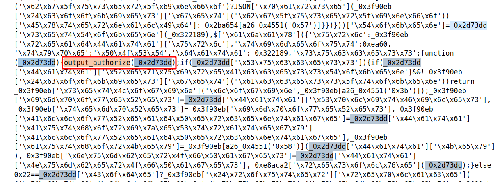
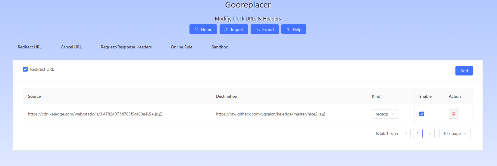
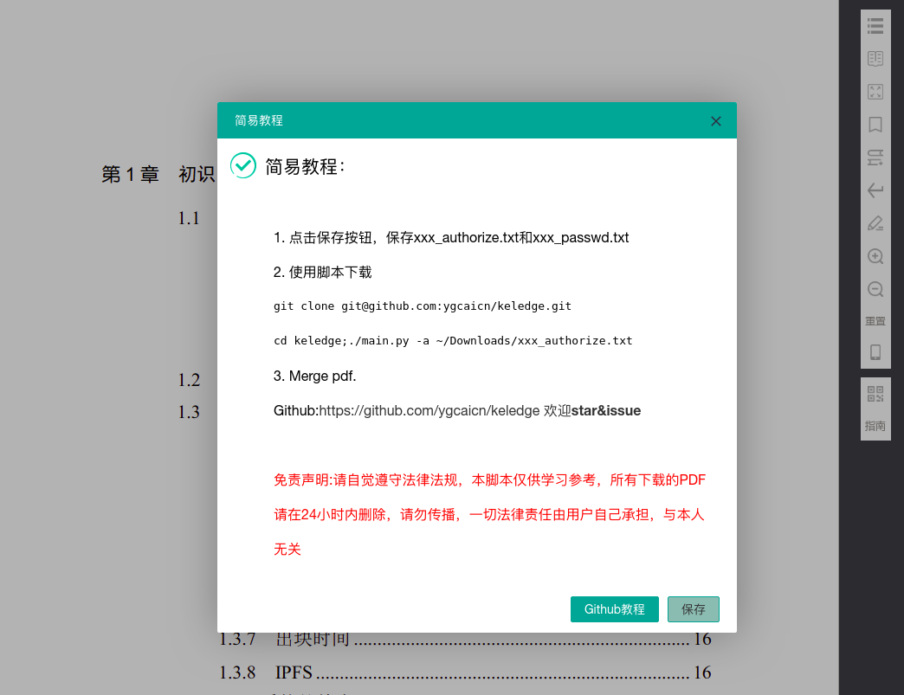
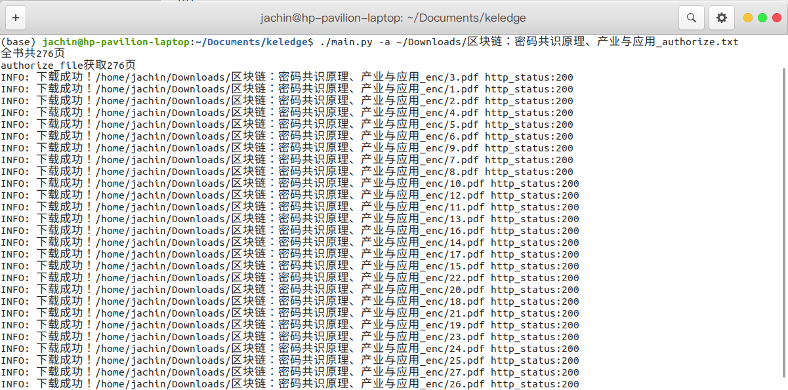
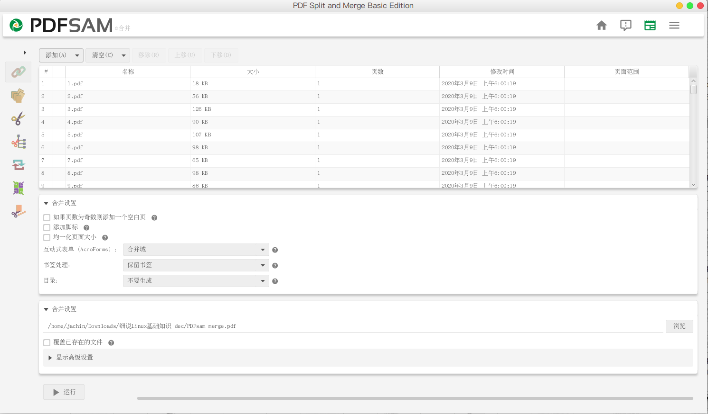

# Keledge Pdf下载

[可知](https://www.keledge.com/)平台pdf下载，仅支持pdf格式资源下载。

## 免责声明

请自觉遵守法律法规，本脚本仅供学习参考，所有下载的PDF请在24小时内删除，请勿传播，一切法律责任由用户自己承担，与本人无关

+ 3.47824973d763f5ca60a4.1583439609949.js

原始js，地址<https://cdn.keledge.com/web/static/js/3.47824973d763f5ca60a4.1583439609949.js>

+ nice.js

使用<http://www.jsnice.org/>对原始js解密得到，无法直接使用，可以用来与nice2.js对比分析逻辑。

为什么无法使用？

代码中使用toString将函数转化为文本，使用re对函数的文本形式进行了检查。。。骚操作！[示例](img/2020-03-11_00-05.png)

+ nice2.js

实际overwirte使用的js。

## 1.获取Pdf信息（加密）

使用直接从Step 3开始即可！

<https://gateway.keledge.com/transfer/aqr/authorize>

在nice.js中：

```js
"success": function(data) {
    if (data["Success"]) {
        if (data["Data"]["RequireAccessToken"] && !result["$cookies"]["get"]("access_token")) {
            return result["setLogin"]("login", result[a26_0x4551("0x3b")]);
        }
        result["impoweRes"] = data["Data"]["SplitFiles"];
        result["tempRes"] = result["impoweRes"];
        result["AllowReadPercentage"] = data["Data"]["AuthorizeStrategy"]["AllowReadPercentage"];
        result["authorKey"] = result[a26_0x4551("0x58")](data["Data"]["Key"]);
        result["numberOfPages"] = data["Data"]["NumberOfPages"];
        self["resolve"](data);
    } else {
        if (34 == data["Code"]) {
            result["$router"]["replace"]({
                "path": "/login",
                "query": {
                    "redirect": result["$route"]["fullPath"]
                }
            });
        } else {
            result["closeView"](data["Description"]);
        }
    }
}
```

在nice2.js中添加Hook output_authorize：



## 2.密钥与解密

```js
case 7:
    return codeGeneratorFunc = node["sent"], ast = CryptoJS["enc"]["Utf8"]["parse"](this["v"]["authorKey"]), generatedCode = CryptoJS["AES"]["decrypt"](codeGeneratorFunc, ast, {
        "mode": CryptoJS["mode"]["ECB"],
        "padding": CryptoJS["pad"]["Pkcs7"]
    }), node["next"] = 12, this["wordArrayToU8"](generatedCode, flightPhase, refresh);
```

在nice2.js中

```js
case 0x7:return _0x322189=_0x2d73dd['\x73\x65\x6e\x74'],_0x3ae007=CryptoJS['\x65\x6e\x63']['\x55\x74\x66\x38']['\x70\x61\x72\x73\x65'](this['\x76']['\x61\x75\x74\x68\x6f\x72\x4b\x65\x79']),_0x10fe46=CryptoJS['\x41\x45\x53']['\x64\x65\x63\x72\x79\x70\x74'](_0x322189,_0x3ae007,{'\x6d\x6f\x64\x65':CryptoJS['\x6d\x6f\x64\x65']['\x45\x43\x42'],'\x70\x61\x64\x64\x69\x6e\x67':CryptoJS['\x70\x61\x64']['\x50\x6b\x63\x73\x37']}),_0x2d73dd['\x6e\x65\x78\x74']=0xc,this['\x77\x6f\x72\x64\x41\x72\x72\x61\x79\x54\x6f\x55\x38'](_0x10fe46,_0xe8aca2,_0x1a2353);
```

在nice2.js中添加Hook output_password之后：

```js
case 0x7:var ast=CryptoJS['\x65\x6e\x63']['\x55\x74\x66\x38']['\x70\x61\x72\x73\x65'](this['\x76']['\x61\x75\x74\x68\x6f\x72\x4b\x65\x79']);output_password(ast);return _0x322189=_0x2d73dd['\x73\x65\x6e\x74'],_0x3ae007=CryptoJS['\x65\x6e\x63']['\x55\x74\x66\x38']['\x70\x61\x72\x73\x65'](this['\x76']['\x61\x75\x74\x68\x6f\x72\x4b\x65\x79']),_0x10fe46=CryptoJS['\x41\x45\x53']['\x64\x65\x63\x72\x79\x70\x74'](_0x322189,_0x3ae007,{'\x6d\x6f\x64\x65':CryptoJS['\x6d\x6f\x64\x65']['\x45\x43\x42'],'\x70\x61\x64\x64\x69\x6e\x67':CryptoJS['\x70\x61\x64']['\x50\x6b\x63\x73\x37']}),_0x2d73dd['\x6e\x65\x78\x74']=0xc,this['\x77\x6f\x72\x64\x41\x72\x72\x61\x79\x54\x6f\x55\x38'](_0x10fe46,_0xe8aca2,_0x1a2353);
```

解密pdf方法：

```sh
openssl enc -d -aes-128-ecb -K 406c322141214d6e4e446e505450386c -in enc.pdf -out dec.pdf
```

## 3.Overwrite js

原理：利用Chrome插件重定向Js地址到我们fake的Js, 保存图书信息以及加密密码。

[Gooreplacer](https://chrome.google.com/webstore/detail/gooreplacer/jnlkjeecojckkigmchmfoigphmgkgbip)



Source: <https://cdn.keledge.com/web/static/js/3.47824973d763f5ca60a4.\S+.js>

Destination: <https://raw.githack.com/ygcaicn/keledge/master/nice2.js>

Kind: regexp



*使用脚本需要登陆帐号对全文有访问权限！*

## 4.Download

解析Step 3保存的authorize.txt下载加密的pdf，然后使用passwd.txt保存的密码解密生成pdf。

*解密pdf依赖系统openssl，windows平台下自行[安装](http://slproweb.com/products/Win32OpenSSL.html)解决！*

```sh
./main.py -a ~/Downloads/1583695806_authorize.txt
```



## 5.Merge



<https://pdfsam.org/>
